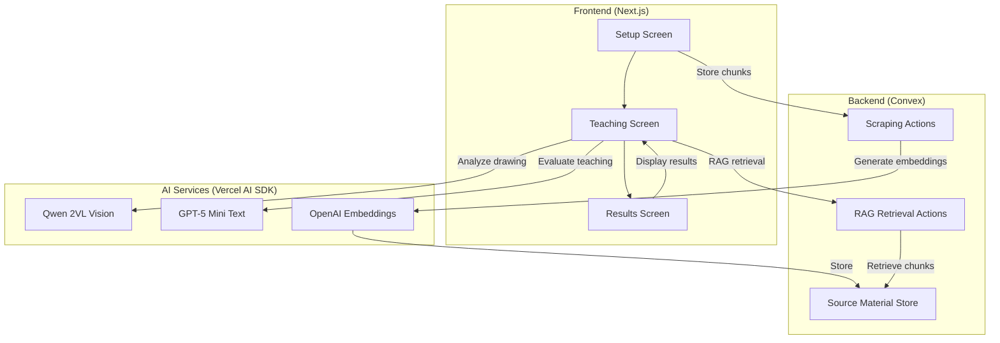

# Design Document

## Overview

The AI Protégé is a Next.js application that implements the Feynman Technique through a "Frankenstein" dual-AI approach. The system combines a vision-specialized model (Qwen 2VL) for analyzing user drawings with a RAG-based text model (GPT-5 mini with embeddings) for fact-checking explanations. This creates genuine tension between visual and textual understanding, as the two models see the world differently. The application follows a three-screen flow: Setup → Teaching → Results.

### Key Design Principles

1. **Dual-Model Architecture**: Two AI models work independently then synthesize results
2. **Minimal MVP**: Focus on core teaching loop without authentication
3. **Real-time Feedback**: Immediate scoring after submission
4. **Stateless Sessions**: No user accounts, sessions stored but not linked to users

## Architecture

### High-Level Architecture



### Technology Stack Integration

- **Next.js 16**: App Router with Server Actions for API endpoints
- **Convex**: Real-time database for source material chunks and session data
- **Vercel AI SDK**: Unified interface for OpenAI & Qwen models
- **tldraw**: Canvas component for drawing interface
- **@mozilla/readability + jsdom**: Web scraping and content extraction

## Components and Interfaces

### Frontend Components

#### 1. Setup Screen (`/app/page.tsx`)

**Purpose**: Capture topic and source URL, initiate scraping

**State Management**:
```typescript
interface SetupState {
  topic: string;
  sourceUrl: string;
  isProcessing: boolean;
  error: string | null;
  sessionId: string | null;
}
```

**Key Interactions**:
- Form validation for URL format
- Call Convex action to scrape and process URL
- Show loading state during processing (5-15 seconds)
- Navigate to teaching screen with sessionId on success
- Store sessionId in component state for subsequent screens

#### 2. Teaching Screen (`/app/teach/[sessionId]/page.tsx`)

**Purpose**: Provide drawing canvas and text input for teaching

**State Management**:
```typescript
interface TeachingState {
  sessionId: string;
  topic: string;
  textExplanation: string;
  characterCount: number;
  isSubmitting: boolean;
  canvasSnapshot: Blob | null;
}
```

**Layout Specification**:
- Split-panel layout with left and right sections
- Left panel (60% width):
  - tldraw canvas: 60% of panel height (top)
  - Text explanation textarea: 40% of panel height (bottom)
- Right panel (40% width):
  - Scrollable feedback area
  - Status indicator
  - "Finish Lesson" button fixed at bottom

**Key Features**:
- tldraw editor embedded in left panel
- Textarea with live character counter (max 5000 characters, input blocked beyond limit)
- Export canvas as PNG on submit using Editor.toImage() method (returns blob, convert to base64 using FileReader API)
- Parallel evaluation flow orchestration:
  1. Call Convex action `retrieveRelevantChunks` with sessionId and text explanation → get top 5 relevant chunks (runs in parallel with step 2)
  2. Call Next.js server action `analyzeDrawing` with canvas image (base64) and topic → get vision analysis (runs in parallel with step 1)
  3. Once both complete, call Next.js server action `evaluateTeaching` with all data (topic, vision analysis, RAG chunks, text explanation) → get final evaluation
- Navigate to results screen with evaluation data via URL search params

#### 3. Results Screen (`/app/results/page.tsx`)

**Purpose**: Display teaching scores and detailed feedback

**State Management**:
```typescript
interface ResultsState {
  overallScore: number;
  clarityScore: number;
  accuracyScore: number;
  completenessScore: number;
  feedback: {
    unclearSections: string[];
    inaccuracies: string[];
    missingConcepts: string[];
    clarifyingQuestions: string[];
  };
}
```

**Data Passing**: Results are passed via URL search parameters. After evaluation completes, navigate to `/results?data={encodedEvaluationJSON}` where the evaluation object is JSON-stringified and URL-encoded. The Results Screen decodes and parses this to display scores and feedback.

**Display Layout**:
- Large overall score (0-100) with visual indicator
- Three score breakdowns with progress bars
- Categorized feedback sections:
  - Unclear sections
  - Inaccuracies
  - Missing concepts
  - **"Questions to Consider"** section displaying clarifying questions (Frankenstein element)
- Option to start new session

### Backend Schema (Convex)

#### Source Material Table

```typescript
// convex/schema.ts
import { defineSchema, defineTable } from "convex/server";
import { v } from "convex/values";

export default defineSchema({
  sourceMaterial: defineTable({
    sessionId: v.string(),
    topic: v.string(),
    sourceUrl: v.string(),
    chunks: v.array(v.object({
      text: v.string(),
      embedding: v.array(v.float64()),
      index: v.number(),
    })),
    createdAt: v.number(),
  }).index("by_session", ["sessionId"]),
});
```

### Backend Actions (Convex)

#### 1. Scrape and Process Action

```typescript
// convex/actions/scrapeSource.ts
```

**Flow**:
1. Fetch URL content using fetch API
2. Parse HTML with jsdom
3. Extract readable content with @mozilla/readability
4. Split into chunks (1000 chars, 200 overlap)
5. Generate embeddings for each chunk (OpenAI embeddings API)
6. Store in sourceMaterial table
7. Return sessionId

**Error Handling**:
- Network errors: Return user-friendly message
- Invalid HTML: Fallback to raw text extraction
- Embedding API failures: Retry once, then fail gracefully

#### 2. RAG Retrieval Query

```typescript
// convex/actions/retrieveRelevantChunks.ts
```

**Flow**:
1. Receive sessionId and user text explanation
2. Generate embedding for text explanation (OpenAI embeddings API)
3. Retrieve all chunks for sessionId from sourceMaterial
4. Calculate cosine similarity between explanation and each chunk
5. Sort chunks by cosine similarity in descending order
6. Return top 5 most similar chunks using `.slice(0, 5)` with similarity scores

**Note**: This is a Convex action (not query) since it calls external API for embeddings

## Data Models

### Chunk Processing

**Chunking Strategy**:
- Max chunk size: 1000 characters
- Overlap: 200 characters
- Preserve sentence boundaries where possible

**Embedding Model**: `text-embedding-3-small`
- Dimensions: 1536
- Cost-effective for MVP
- Sufficient accuracy for semantic search

### Vision Analysis Output

```typescript
interface VisionAnalysis {
  conceptsDrawn: string[];
  relationships: string[];
  clarity: number; // 0-10
  completeness: number; // 0-10
  observations: string;
}
```

### RAG Retrieval Output

```typescript
interface RAGContext {
  relevantChunks: Array<{
    text: string;
    similarity: number;
  }>;
  keyConceptsFromSource: string[];
}
```

### Final Evaluation Output

```typescript
interface EvaluationResult {
  overallScore: number; // 0-100
  clarityScore: number; // 0-100
  accuracyScore: number; // 0-100
  completenessScore: number; // 0-100
  feedback: {
    unclearSections: string[];
    inaccuracies: string[];
    missingConcepts: string[];
    clarifyingQuestions: string[]; // Questions generated when vision and text don't align
  };
  reasoning: string; // For debugging
}
```

## AI Integration Details

### Architecture: Convex Actions vs Server Actions

**Convex Actions** (for RAG operations):
- Scraping and embedding generation
- RAG retrieval with similarity search
- Access to Convex database for chunk storage

**Next.js Server Actions** (for Vision/Text AI):
- Vision model analysis of drawings
- Text model synthesis and evaluation
- Stateless operations that don't need database access

### 1. Vision Model (Qwen 2VL) - Server Action

**Location**: `app/actions/analyzeDrawing.ts`

**Purpose**: Analyze user's drawing to understand visual teaching using a vision-specialized model

**Model**: `qwen/qwen-2-vl-7b-instruct` via HuggingFace provider in ai-sdk (requires `HUGGING_FACE_API_KEY`)

**Reference**: https://sdk.vercel.ai/docs/ai-sdk-core/generating-structured-data & [text](https://ai-sdk.dev/providers/ai-sdk-providers/huggingface)

**Prompt Template**:
```
You are analyzing a teaching diagram drawn by a student learning about: {topic}

Analyze this drawing and provide:
1. What concepts are being illustrated
2. What relationships or connections are shown
3. Rate the clarity of the visual explanation (0-10)
4. Rate the completeness of visual coverage (0-10)
5. Any observations about the teaching approach

Return your analysis in JSON format.
```

**API Call**:
```typescript
'use server';

import { generateObject } from 'ai';
import { createOpenAI } from '@ai-sdk/openai';
import { z } from 'zod';

const huggingface = createOpenAI({
  baseURL: 'https://api-inference.huggingface.co/v1/',
  apiKey: process.env.HUGGING_FACE_API_KEY,
});

const visionAnalysisSchema = z.object({
  conceptsDrawn: z.array(z.string()),
  relationships: z.array(z.string()),
  clarity: z.number().min(0).max(10),
  completeness: z.number().min(0).max(10),
  observations: z.string(),
});

export async function analyzeDrawing(canvasImageBase64: string, topic: string) {
  const visionAnalysis = await generateObject({
    model: huggingface('qwen/qwen-2-vl-7b-instruct'),
    messages: [{
      role: 'user',
      content: [
        { type: 'text', text: visionPrompt },
        { type: 'image', image: canvasImageBase64 }
      ]
    }],
    schema: visionAnalysisSchema,
  });
  
  return visionAnalysis.object;
}
```

### 2. Embedding Model (OpenAI) - Convex Action

**Location**: `convex/actions/embeddings.ts`

**Purpose**: Generate embeddings for semantic search

**Reference**: https://sdk.vercel.ai/docs/ai-sdk-core/embeddings

**For Source Chunks**:
```typescript
import { embed } from 'ai';
import { openai } from '@ai-sdk/openai';

const { embedding } = await embed({
  model: openai.embedding('text-embedding-3-small'),
  value: chunkText,
});
```

**For User Explanation**:
- Same process as source chunks
- Compare using cosine similarity
- Retrieve top 5 matches

**Cosine Similarity Function**:
```typescript
function cosineSimilarity(a: number[], b: number[]): number {
  const dotProduct = a.reduce((sum, val, i) => sum + val * b[i], 0);
  const magnitudeA = Math.sqrt(a.reduce((sum, val) => sum + val * val, 0));
  const magnitudeB = Math.sqrt(b.reduce((sum, val) => sum + val * val, 0));
  return dotProduct / (magnitudeA * magnitudeB);
}
```

### 3. Text Model (GPT-5 Mini) - Server Action

**Location**: `app/actions/evaluateTeaching.ts`

**Purpose**: Synthesize vision and RAG results into final evaluation

**Reference**: https://sdk.vercel.ai/docs/ai-sdk-core/generating-structured-data

**Prompt Template**:
```
You are evaluating a student's teaching about: {topic}

SOURCE MATERIAL (Top 5 relevant sections):
{ragChunks}

VISUAL ANALYSIS:
The student drew a diagram showing: {visionAnalysis.conceptsDrawn}
Relationships illustrated: {visionAnalysis.relationships}
Visual clarity: {visionAnalysis.clarity}/10
Visual completeness: {visionAnalysis.completeness}/10

STUDENT'S TEXT EXPLANATION:
{textExplanation}

Evaluate the teaching effectiveness:
1. Clarity Score (0-100): How well did they explain concepts?
2. Accuracy Score (0-100): How factually correct is their teaching?
3. Completeness Score (0-100): Did they cover key concepts from source?
4. Overall Score (0-100): Weighted average (Clarity 30%, Accuracy 40%, Completeness 30%)

Provide specific feedback:
- Unclear sections that need improvement
- Factual inaccuracies compared to source material
- Missing key concepts from the source

IMPORTANT - Generate Clarifying Questions:
When the vision analysis and text explanation don't align or when one modality is clearer than the other, generate specific questions that would help the student clarify their teaching. For example:
- "Your drawing shows a connection between X and Y, but you didn't explain this relationship in your text. What is the nature of this connection?"
- "You mentioned Z in your explanation, but I don't see this process illustrated in your diagram. Can you point out where this is shown?"

These questions help reconcile the two different AI perspectives (vision vs text) and make gaps visible to the student.

Return structured JSON output.
```

**API Call**:
```typescript
'use server';

import { generateObject } from 'ai';
import { openai } from '@ai-sdk/openai';
import { z } from 'zod';

const evaluationSchema = z.object({
  overallScore: z.number().min(0).max(100),
  clarityScore: z.number().min(0).max(100),
  accuracyScore: z.number().min(0).max(100),
  completenessScore: z.number().min(0).max(100),
  feedback: z.object({
    unclearSections: z.array(z.string()),
    inaccuracies: z.array(z.string()),
    missingConcepts: z.array(z.string()),
    clarifyingQuestions: z.array(z.string()),
  }),
  reasoning: z.string(),
});

export async function evaluateTeaching(
  topic: string,
  visionAnalysis: VisionAnalysis,
  ragChunks: RAGContext,
  textExplanation: string
) {
  const evaluation = await generateObject({
    model: openai('gpt-5-mini'),
    messages: [{ role: 'user', content: evaluationPrompt }],
    schema: evaluationSchema,
  });
  
  return evaluation.object;
}
```

## Error Handling

### Scraping Errors

1. **Network Failures**: Display "Unable to reach URL. Please check the link and try again."
2. **Invalid Content**: Display "Unable to extract readable content. Try a different URL."
3. **Timeout**: 30-second timeout, then fail with retry option

### AI API Errors

1. **Rate Limits**: Retry with exponential backoff (max 3 attempts)
2. **Invalid Responses**: Log error, return generic feedback
3. **Timeout**: 60-second timeout for AI calls

### Storage Errors

1. **Convex Mutations**: Wrap in try-catch, display user-friendly errors
2. **Image Upload**: Validate size (<5MB), format (PNG), then upload

## Testing Strategy

### Unit Tests (Vitest)

For a 3-day MVP, focus only on critical pure functions:

**Test 1: Text Chunking Algorithm**
- Verify 1000 character chunks with 200 character overlap work correctly
- Test edge cases: empty text, text shorter than chunk size, exact chunk boundaries
- Ensure sentence boundaries are preserved where possible

**Test 2: Cosine Similarity Calculation**
- Verify the math is correct with known vector pairs
- Test edge cases: zero vectors, identical vectors, orthogonal vectors
- Validate output range is [0, 1]

**Location**: `__tests__/utils/chunking.test.ts` and `__tests__/utils/similarity.test.ts`

### Manual Testing Instructions

Comprehensive testing and end-to-end tests are out of scope for the MVP. Use manual testing for all other functionality:

**Setup Flow**:
1. Test various URL types (documentation sites, articles, Wikipedia pages)
2. Verify error handling for invalid URLs (404s, malformed URLs, non-HTML content)
3. Confirm loading states display during scraping (5-15 seconds)
4. Check that sessionId is generated and passed to teaching screen

**Teaching Flow**:
1. Draw simple diagrams (2-3 shapes) and complex diagrams (10+ elements with connections)
2. Test character limit enforcement:
   - At 4999 characters: should allow input
   - At exactly 5000 characters: should allow input
   - Attempting 5001 characters: should be blocked by input
3. Verify live character counter updates correctly
4. Test canvas export using Editor.toImage() method
5. Confirm parallel evaluation flow completes (RAG + Vision in parallel → Evaluation)
6. Check loading states during evaluation (10-20 seconds)

**Results Flow**:
1. Verify all scores display correctly (overall + 3 breakdowns)
2. Check that feedback sections populate with relevant content
3. Confirm "Questions to Consider" section displays clarifying questions
4. Test "Start New Session" button returns to setup screen
5. Verify URL search params contain encoded evaluation data

**Error Scenarios**:
1. Network failures during scraping
2. AI API timeouts or rate limits
3. Invalid canvas data
4. Missing or corrupted session data

## Performance Considerations

### Optimization Strategies

1. **Parallel AI Calls**: Vision and RAG happen simultaneously
2. **Embedding Caching**: Store embeddings, don't regenerate
3. **Chunk Limit**: Cap source material at 50 chunks (50,000 chars)
4. **Image Compression**: Compress canvas to reasonable size before upload

### Expected Latencies

- Scraping + Processing: 5-15 seconds
- Evaluation: 10-20 seconds (parallel AI calls)
- Total user wait: ~30 seconds maximum

## Security Considerations

1. **URL Validation**: Whitelist HTTP/HTTPS, block localhost/private IPs
2. **Content Size Limits**: Max 100KB scraped content
3. **Rate Limiting**: Limit sessions per IP (future enhancement)
4. **Input Sanitization**: Sanitize all user inputs before storage

## Future Enhancements (Out of Scope for MVP)

- User authentication and session history
- Multiple teaching attempts per topic
- Progress tracking over time
- Social sharing of scores
- More AI models (Claude, Gemini)
- Voice explanation option
- Mobile-optimized canvas
