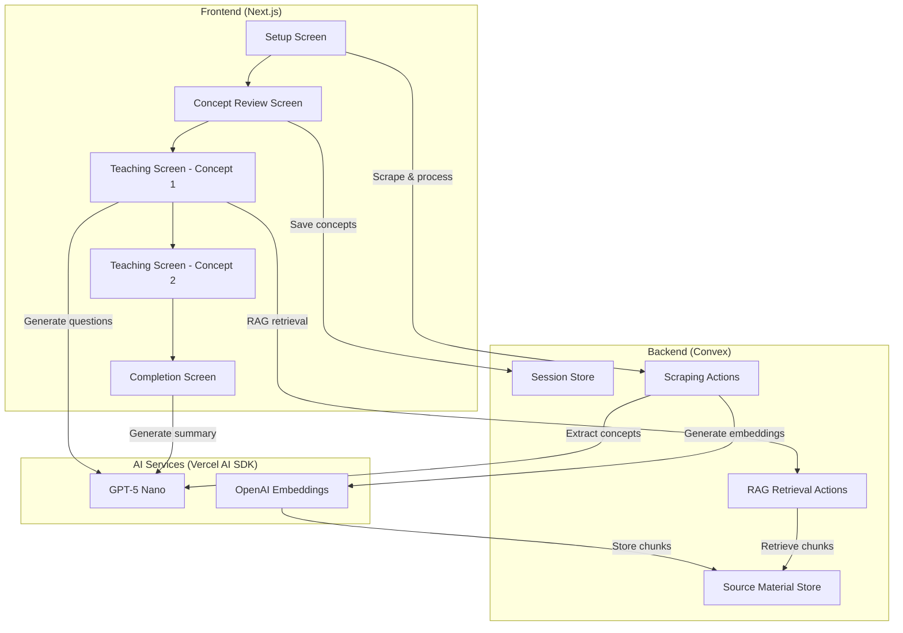

# Design Document - AI Protégé v2

## Overview

The AI Protégé v2 is a Next.js application that implements the Feynman Technique through real-time dialogue with an AI "12-year-old student". The system uses GPT-5 nano for conversational AI and RAG (Retrieval-Augmented Generation) for fact-checking against source material. The application follows a multi-screen flow: Setup → Concept Review → Teaching (per concept) → Completion.

### Key Design Principles

1. **Real-Time Dialogue**: AI asks questions while user teaches, not after
2. **Concept-by-Concept**: Focus on one topic at a time for clarity
3. **User Control**: User decides when they're done explaining each concept
4. **Fast Responses**: 3-5 second AI response time for natural conversation
5. **Minimal MVP**: Focus on core teaching loop without authentication

## Architecture

### High-Level Architecture



### Technology Stack Integration

- **Next.js 15**: App Router with Server Actions for AI endpoints
- **Convex**: Real-time database for source material, sessions, and progress
- **Vercel AI SDK**: Unified interface for OpenAI models
- **tldraw**: Canvas component for drawing interface
- **@mozilla/readability + jsdom**: Web scraping and content extraction

## Components and Interfaces

### Frontend Components

#### 1. Setup Screen (`/app/page.tsx`)

**Purpose**: Capture topic and source URL, initiate scraping and concept extraction

**State Management**:
```typescript
interface SetupState {
  topic: string;
  sourceUrl: string;
  isProcessing: boolean;
  error: string | null;
  sessionId: string | null;
}
```

**Key Interactions**:
- Form validation for URL format
- Call Convex action to scrape and process URL
- Call Server Action to extract key concepts (3-5)
- Show loading state during processing (10-15 seconds)
- Navigate to concept review screen with sessionId and concepts
- Store sessionId in URL for session persistence

#### 2. Concept Review Screen (`/app/review/[sessionId]/page.tsx`)

**Purpose**: Allow user to review, edit, add, or delete extracted concepts

**State Management**:
```typescript
interface ConceptReviewState {
  sessionId: string;
  topic: string;
  concepts: Array<{
    id: string;
    title: string;
    description: string;
  }>;
  isEditing: boolean;
}
```

**Layout Specification**:
- Header: Topic name and session info
- Concept list: Editable cards for each concept
- Each card shows:
  - Concept title (editable input)
  - Brief description (editable textarea)
  - Delete button (X icon)
- "Add Concept" button at bottom
- "Start Teaching" button (disabled if no concepts)

**Key Features**:
- Inline editing of concept titles and descriptions
- Add new concepts with default template
- Delete concepts (with confirmation if only 1 left)
- Validation: minimum 1 concept, maximum 10 concepts
- Save concepts to Convex before proceeding
- Navigate to first concept teaching screen

#### 3. Teaching Screen (`/app/teach/[sessionId]/[conceptIndex]/page.tsx`)

**Purpose**: Provide drawing canvas and text input for teaching one concept, display AI dialogue

**State Management**:
```typescript
interface TeachingState {
  sessionId: string;
  conceptIndex: number;
  totalConcepts: number;
  currentConcept: {
    id: string;
    title: string;
    description: string;
  };
  textExplanation: string;
  canvasSnapshot: Blob | null;
  dialogue: Array<{
    role: 'user' | 'ai';
    content: string;
    timestamp: number;
  }>;
  isAIThinking: boolean;
  showHintButton: boolean;
  jargonWords: string[];
  lastActivityTime: number;
}
```

**Layout Specification**:
- Top bar: Progress indicator "Concept 2/5: [Concept Title]"
- Split-panel layout:
  - **Left panel (60% width)**:
    - tldraw canvas: 50% of panel height (top)
    - Text explanation textarea: 50% of panel height (bottom)
    - "Done Explaining" button at bottom
  - **Right panel (40% width)**:
    - Dialogue history (scrollable)
    - AI questions and user responses
    - "Need a Hint?" button (appears after 30s inactivity)
    - "Move to Next Concept" button (appears after AI engagement)

**Key Features**:

**Canvas & Text Input**:
- tldraw editor embedded in left panel
- Textarea for text explanation (no character limit)
- Track drawing actions (shapes added, connections made)
- Export canvas as PNG on "Done Explaining" using Editor.toImage()

**Jargon Detection**:
- On component mount, subscribe to Convex query `getSourceMaterial(sessionId)` to fetch jargonWords
- Store jargonWords in component state
- Frontend checks text input against jargonWords list in real-time
- When jargon detected, highlight jargon word in text (yellow background)
- On hover, show tooltip: "Simplify this?"
- No AI calls triggered by jargon detection (informational only)

**AI Dialogue Flow**:
1. User clicks "Done Explaining"
2. Three parallel operations:
   - Convex action: retrieveRelevantChunks (sessionId, textExplanation) → top 5 chunks
   - Convert canvas to base64 image
   - Server action: generateClarityQuestions (concept, textExplanation, canvasImage) → 1-2 questions
3. Once RAG chunks arrive, Server action: generateAccuracyQuestions (concept, textExplanation, ragChunks) → 1-2 questions
4. Display questions in right panel as they arrive (clarity questions first, then accuracy questions)
5. User types response in dialogue input
6. Send response to AI for follow-up (streaming response)
7. Continue dialogue until user clicks "Move to Next Concept"

**Hint System**:
- Frontend timer tracks inactivity (30 seconds)
- Show "Need a Hint?" button when timer expires
- On click: Server action generateHint (concept, currentDialogue) → hint text
- Display hint in dialogue as AI message
- Reset timer on any user activity

**Analogy Requests**:
- AI determines if explanation is correct but abstract
- If so, AI includes analogy request in its response
- AI asks: "Can you explain this using an analogy?"
- User provides analogy in dialogue
- AI asks follow-up: "How is [concept] similar to [analogy]?"

#### 4. Completion Screen (`/app/complete/[sessionId]/page.tsx`)

**Purpose**: Display AI's summary of what it learned

**State Management**:
```typescript
interface CompletionState {
  sessionId: string;
  topic: string;
  summary: string;
  isGeneratingSummary: boolean;
}
```

**Display Layout**:
- Large heading: "I think I understand [topic] now!"
- AI's summary of the topic (generated from all concept dialogues)
- Two buttons:
  - "That's correct!" → Show completion message
  - "Let me clarify..." → Return to concept selection
- "Start New Session" button at bottom

**Key Features**:
- Generate summary using Server Action: generateSummary (sessionId, allDialogues)
- Summary uses user's explanations and analogies
- Option to return to any concept for clarification
- Completion message: "Great teaching! You've helped me learn [topic]."

### Backend Schema (Convex)

#### Source Material Table with Vector Index

```typescript
// convex/schema.ts
import { defineSchema, defineTable } from "convex/server";
import { v } from "convex/values";

export default defineSchema({
  sourceMaterial: defineTable({
    sessionId: v.string(),
    topic: v.string(),
    sourceUrl: v.string(),
    text: v.string(),
    embedding: v.array(v.float64()),
    chunkIndex: v.number(),
    jargonWords: v.array(v.string()),
    createdAt: v.number(),
  })
    .index("by_session", ["sessionId"])
    .vectorIndex("by_embedding", {
      vectorField: "embedding",
      dimensions: 1536,
      filterFields: ["sessionId"],
    }),
  
  sessions: defineTable({
    sessionId: v.string(),
    topic: v.string(),
    concepts: v.array(v.object({
      id: v.string(),
      title: v.string(),
      description: v.string(),
    })),
    currentConceptIndex: v.number(),
    dialogues: v.array(v.object({
      conceptId: v.string(),
      messages: v.array(v.object({
        role: v.string(),
        content: v.string(),
        timestamp: v.number(),
      })),
    })),
    completed: v.boolean(),
    createdAt: v.number(),
    updatedAt: v.number(),
  }).index("by_session_id", ["sessionId"]),
});
```

### Backend Actions (Convex)

#### 1. Scrape and Process Action

```typescript
// convex/actions/scrapeSource.ts
```

**Flow**:
1. Fetch URL content using fetch API
2. Parse HTML with jsdom
3. Extract readable content with @mozilla/readability
4. Split into chunks (1000 chars, 200 overlap)
5. Generate embeddings for each chunk (OpenAI embeddings API)
6. Extract jargon words (words >10 chars or technical terms)
7. Store in sourceMaterial table
8. Return sessionId and jargonWords

**Error Handling**:
- Network errors: Return user-friendly message
- Invalid HTML: Fallback to raw text extraction
- Embedding API failures: Retry once, then fail gracefully

#### 2. RAG Retrieval with Vector Search

```typescript
// convex/actions/retrieveRelevantChunks.ts
```

**Flow**:
1. Receive sessionId and user text explanation
2. Generate embedding for text explanation (OpenAI embeddings API)
3. Use Convex vector search to find similar chunks:
   - `ctx.vectorSearch("sourceMaterial", "by_embedding", { vector, limit: 5, filter: (q) => q.eq("sessionId", sessionId) })`
4. Return top 5 most similar chunks with similarity scores

**Note**: This is a Convex action (not query) since it calls external API for embeddings and uses vectorSearch (only available in actions)

#### 3. Session Management Mutations & Queries

```typescript
// convex/mutations.ts
```

**createSession**: Create new session with concepts
**updateConcepts**: Update concepts list after user edits
**saveDialogue**: Save user-AI dialogue for a concept
**updateProgress**: Update current concept index
**markComplete**: Mark session as completed

```typescript
// convex/queries.ts
```

**getSourceMaterial**: Query to fetch source material (including jargonWords) by sessionId
**getSession**: Query to fetch session data by sessionId

## Data Models

### Chunk Processing

**Chunking Strategy**:
- Max chunk size: 1000 characters
- Overlap: 200 characters
- Preserve sentence boundaries where possible

**Embedding Model**: `text-embedding-3-small`
- Dimensions: 1536
- Cost-effective for MVP
- Sufficient accuracy for semantic search

### Jargon Extraction

**Strategy**:
- Extract words longer than 10 characters
- Identify technical terms using frequency analysis
- Store top 20-30 jargon words per source
- Use for real-time detection in frontend

### AI Question Output

```typescript
interface AIQuestionResponse {
  questions: string[];
  requestsAnalogy: boolean;
  tone: 'curious' | 'confused' | 'clarifying';
}
```

### AI Summary Output

```typescript
interface AISummaryResponse {
  summary: string;
  keyConceptsCovered: string[];
  confidence: number; // 0-10
}
```

## AI Integration Details

### Architecture: Server Actions for All AI Calls

All AI interactions use Next.js Server Actions for simplicity and speed.

### 1. Concept Extraction - Server Action

**Location**: `app/actions/extractConcepts.ts`

**Purpose**: Extract 3-5 key concepts from scraped source material

**Model**: GPT-5 nano

**Prompt Template**:
```
You are helping a student learn about: {topic}

Here is the source material:
{sourceText}

Extract 3-5 key concepts that a student should understand about this topic.
For each concept, provide:
1. A clear title (2-5 words)
2. A brief description (1-2 sentences)

These concepts should be teachable independently and cover the main ideas of the topic.

Return your response in JSON format.
```

**API Call**:
```typescript
'use server';

import { generateObject } from 'ai';
import { openai } from '@ai-sdk/openai';
import { z } from 'zod';

const conceptSchema = z.object({
  concepts: z.array(z.object({
    title: z.string(),
    description: z.string(),
  })),
});

export async function extractConcepts(topic: string, sourceText: string) {
  const result = await generateObject({
    model: openai('gpt-5-nano'),
    messages: [{ role: 'user', content: promptTemplate }],
    schema: conceptSchema,
  });
  
  return result.object.concepts.map((c, i) => ({
    id: `concept-${i}`,
    ...c,
  }));
}
```

### 2A. Clarity Question Generation - Server Action

**Location**: `app/actions/generateClarityQuestions.ts`

**Purpose**: Generate 1-2 questions about clarity and simplicity as a curious 12-year-old

**Model**: GPT-5 nano (multimodal)

**Prompt Template**:
```
You are a curious 12-year-old student learning about: {conceptTitle}

The teacher is explaining: {conceptDescription}

TEACHER'S DRAWING:
[Image of canvas]

TEACHER'S EXPLANATION:
{textExplanation}

You have no prior knowledge of this topic. Ask 1-2 questions about CLARITY and SIMPLICITY:
1. Request simplification if complex terms are used
2. Ask for clarification on unclear parts
3. Request drawings if concepts are abstract
4. If the explanation seems correct but abstract, request an analogy

Be genuinely curious and confused when things aren't clear. Use simple language.

Examples:
- "Wait, I don't get it - how does X connect to Y?"
- "Can you draw that part? I'm a visual learner!"
- "That word is too complicated, can you explain it simpler?"
- "Can you explain this using an analogy or comparison?"

Return your questions in JSON format.
```

**API Call**:
```typescript
'use server';

import { generateObject } from 'ai';
import { openai } from '@ai-sdk/openai';
import { z } from 'zod';

const clarityQuestionSchema = z.object({
  questions: z.array(z.string()),
  requestsAnalogy: z.boolean(),
});

export async function generateClarityQuestions(
  concept: { title: string; description: string },
  textExplanation: string,
  canvasImageBase64: string
) {
  const result = await generateObject({
    model: openai('gpt-5-nano'),
    messages: [{
      role: 'user',
      content: [
        { type: 'text', text: promptTemplate },
        { type: 'image', image: canvasImageBase64 },
      ],
    }],
    schema: clarityQuestionSchema,
  });
  
  return result.object;
}
```

### 2B. Accuracy Question Generation - Server Action

**Location**: `app/actions/generateAccuracyQuestions.ts`

**Purpose**: Generate 1-2 questions about factual accuracy using RAG

**Model**: GPT-5 nano

**Prompt Template**:
```
You are a curious 12-year-old student learning about: {conceptTitle}

The teacher is explaining: {conceptDescription}

SOURCE MATERIAL (for fact-checking):
{ragChunks}

TEACHER'S EXPLANATION:
{textExplanation}

You have no prior knowledge of this topic. Ask 1-2 questions about ACCURACY:
1. Check if the explanation matches the source material
2. Ask about missing important details from the source
3. Question anything that seems different from what the source says

Be genuinely curious. Use simple language.

Examples:
- "The source says X, but you said Y. Which one is right?"
- "I read that Z is important. Why didn't you mention it?"
- "Is that really how it works?"

Return your questions in JSON format.
```

**API Call**:
```typescript
'use server';

import { generateObject } from 'ai';
import { openai } from '@ai-sdk/openai';
import { z } from 'zod';

const accuracyQuestionSchema = z.object({
  questions: z.array(z.string()),
});

export async function generateAccuracyQuestions(
  concept: { title: string; description: string },
  textExplanation: string,
  ragChunks: Array<{ text: string; similarity: number }>
) {
  const result = await generateObject({
    model: openai('gpt-5-nano'),
    messages: [{
      role: 'user',
      content: promptTemplate,
    }],
    schema: accuracyQuestionSchema,
  });
  
  return result.object;
}
```

### 3. Dialogue Response - Server Action with Streaming

**Location**: `app/actions/generateDialogueResponse.ts`

**Purpose**: Respond to user's answer in ongoing dialogue

**Model**: GPT-5 nano

**API Call**:
```typescript
'use server';

import { streamText } from 'ai';
import { openai } from '@ai-sdk/openai';
import { createStreamableValue } from 'ai/rsc';

export async function generateDialogueResponse(
  concept: { title: string; description: string },
  dialogueHistory: Array<{ role: string; content: string }>,
  ragChunks: Array<{ text: string; similarity: number }>
) {
  const stream = createStreamableValue('');
  
  (async () => {
    const { textStream } = await streamText({
      model: openai('gpt-5-nano'),
      messages: [
        { role: 'system', content: systemPrompt },
        ...dialogueHistory,
      ],
      maxTokens: 150,
    });
    
    for await (const delta of textStream) {
      stream.update(delta);
    }
    
    stream.done();
  })();
  
  return { output: stream.value };
}
```

### 4. Hint Generation - Server Action

**Location**: `app/actions/generateHint.ts`

**Purpose**: Provide hints when user is stuck

**Model**: GPT-5 nano

**Prompt Template**:
```
The student is stuck on this question: {lastAIQuestion}

Their explanation so far: {userExplanation}

Relevant source material: {ragChunks}

Provide a helpful hint that:
1. Doesn't give away the full answer
2. Guides them toward the right direction
3. Uses simple language
4. Encourages them to think

If this is their second hint request, be more specific.
If this is their third hint request, tell them to check the source material.
```

### 5. Summary Generation - Server Action

**Location**: `app/actions/generateSummary.ts`

**Purpose**: Summarize what AI learned from all concepts

**Model**: GPT-5 nano

**Prompt Template**:
```
You are a 12-year-old student who just learned about: {topic}

Here's what your teacher taught you across {numConcepts} concepts:

{allDialogues}

Summarize what you learned in your own words. Show that you understood:
1. The main ideas
2. How concepts connect
3. Any analogies that helped you understand

Be enthusiastic and show genuine understanding. Use simple language.
```

## Error Handling

### Scraping Errors

1. **Network Failures**: Display "Unable to reach URL. Please check the link and try again."
2. **Invalid Content**: Display "Unable to extract readable content. Try a different URL."
3. **Timeout**: 30-second timeout, then fail with retry option

### AI API Errors

1. **Rate Limits**: Retry with exponential backoff (max 3 attempts)
2. **Invalid Responses**: Log error, ask user to rephrase
3. **Timeout**: 30-second timeout for AI calls

### Storage Errors

1. **Convex Mutations**: Wrap in try-catch, display user-friendly errors
2. **Image Upload**: Validate size (<5MB), format (PNG)

## Performance Considerations

### Optimization Strategies

1. **Parallel Calls**: RAG retrieval and canvas processing happen simultaneously
2. **Streaming Responses**: Use streamText for dialogue to feel faster
3. **Embedding Caching**: Store embeddings, don't regenerate
4. **Chunk Limit**: Cap source material at 50 chunks (50,000 chars)
5. **Image Compression**: Compress canvas to reasonable size before upload

### Expected Latencies

- Scraping + Processing + Concept Extraction: 10-15 seconds
- AI Question Generation: 3-5 seconds
- Dialogue Response (streaming): 2-3 seconds
- Hint Generation: 2-3 seconds
- Summary Generation: 5-10 seconds

## Security Considerations

1. **URL Validation**: Whitelist HTTP/HTTPS, block localhost/private IPs
2. **Content Size Limits**: Max 100KB scraped content
3. **Rate Limiting**: Limit sessions per IP (future enhancement)
4. **Input Sanitization**: Sanitize all user inputs before storage

## Testing Strategy

### Unit Tests (Vitest)

Focus only on critical pure functions:

**Test 1: Text Chunking Algorithm**
- Verify 1000 character chunks with 200 character overlap
- Test edge cases: empty text, text shorter than chunk size

**Test 2: Cosine Similarity Calculation**
- Verify math with known vector pairs
- Test edge cases: zero vectors, identical vectors

**Test 3: Jargon Extraction**
- Verify extraction of complex terms
- Test filtering of common words

**Location**: `__tests__/utils/`

### Manual Testing Instructions

**Setup Flow**:
1. Test various URL types (documentation, articles, Wikipedia)
2. Verify error handling for invalid URLs
3. Confirm concept extraction produces 3-5 concepts
4. Test concept review: edit, add, delete concepts

**Teaching Flow**:
1. Test "Done Explaining" button triggers AI questions
2. Verify jargon detection highlights terms and triggers questions
3. Test hint system after 30s inactivity
4. Verify dialogue continues naturally
5. Test "Move to Next Concept" navigation

**Completion Flow**:
1. Verify summary generation after all concepts
2. Test "That's correct!" completion
3. Test "Let me clarify..." returns to concepts

## Future Enhancements (Out of Scope for MVP)

- Voice input (Option 3 from brainstorm)
- User authentication and session history
- Progress tracking over time
- Social sharing
- Mobile-optimized canvas
- Multiple AI student personalities
