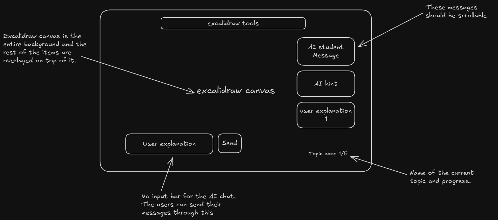
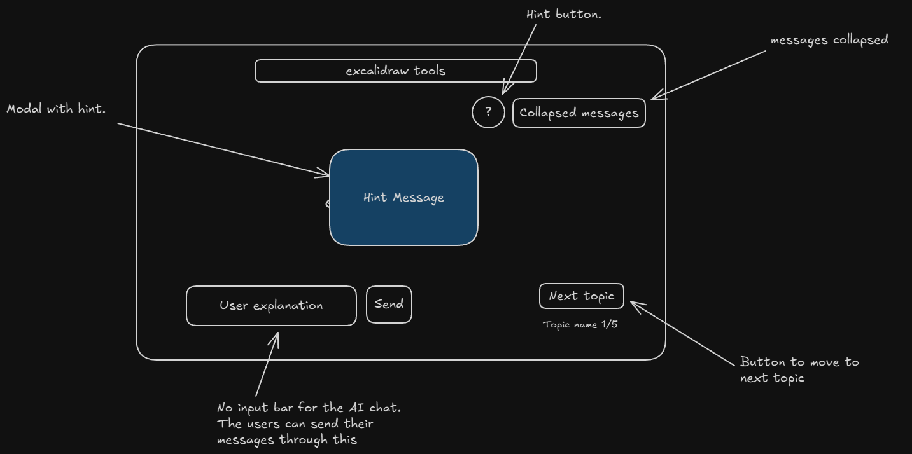

# Requirements Document

## Wireframes

### Wireframe 1 - Main Layout

### Wireframe 2 - Collapsed Messages & Hint Modal

## Introduction

This document specifies the requirements for redesigning the AI Protégé teaching interface to use Excalidraw as a full-screen infinite canvas with overlay UI elements. The redesign aims to simplify the user experience by making the canvas the primary focus, with chat messages, input controls, and navigation overlaid on top. Topics will be arranged in a grid pattern on the infinite canvas, allowing users to build a comprehensive visual study guide that can be exported at the end of their session.

## Glossary

- **Excalidraw**: An open-source virtual whiteboard library for sketching hand-drawn diagrams
- **Teaching_Interface**: The main UI where users explain concepts to the AI student through drawings and text
- **Canvas**: The Excalidraw drawing surface that serves as the full-screen background
- **Overlay_UI**: UI elements (messages, input, buttons) positioned on top of the canvas
- **Topic_Area**: A designated region on the canvas where a user explains a specific concept
- **Message_Panel**: The collapsible panel displaying AI student responses and user messages
- **Hint_Modal**: A modal dialog displaying a pre-generated hint for the current topic
- **Jargon_Highlighting**: Visual highlighting of technical terms from source material in the input field
- **Zen_Mode**: Excalidraw mode that hides side panels for a cleaner interface
- **Session**: A complete learning session containing multiple topics/concepts

## Requirements

### Requirement 1

**User Story:** As a learner, I want the Excalidraw canvas to be the entire background of the teaching interface, so that I have maximum space for drawing and explaining concepts.

#### Acceptance Criteria

1. WHEN the Teaching_Interface loads, THE Canvas SHALL occupy 100% of the viewport width and height
2. WHEN the Teaching_Interface renders, THE Canvas SHALL be positioned at z-index 0 with Overlay_UI elements above it
3. WHILE the user interacts with Overlay_UI elements, THE Canvas SHALL remain interactive in areas not covered by overlays
4. WHEN Excalidraw initializes, THE Canvas SHALL load in Zen_Mode to hide unnecessary side panels
5. WHEN the Teaching_Interface loads, THE Canvas SHALL display the Excalidraw toolbar at the top center of the screen

### Requirement 2

**User Story:** As a learner, I want to send text explanations to the AI student through a single input field, so that I can communicate without a cluttered interface.

#### Acceptance Criteria

1. WHEN the Teaching_Interface renders, THE Overlay_UI SHALL display an input field with a Send button at the bottom-left of the screen
2. WHEN a user types in the input field and clicks Send or presses Enter, THE Teaching_Interface SHALL submit the explanation along with the current Topic_Area canvas elements to the AI
3. WHILE the user types in the input field, THE Teaching_Interface SHALL highlight Jargon terms using a transparent textarea over a highlight layer (adapting existing JargonHighlightedTextarea logic)
4. WHEN a message is being processed, THE Send button SHALL display a loading state and be disabled
5. WHEN the input field has pointer events, THE Canvas SHALL not receive those pointer events (pointer-events isolation)
6. WHEN the input field is focused, THE Teaching_Interface SHALL prevent Excalidraw keyboard shortcuts from activating by stopping event propagation
7. WHEN exporting canvas for AI, THE Teaching_Interface SHALL filter elements by current topic's customData tag and export only those elements as PNG

### Requirement 3

**User Story:** As a learner, I want to view AI responses in a collapsible message panel, so that I can focus on drawing when needed.

#### Acceptance Criteria

1. WHEN the Teaching_Interface renders, THE Message_Panel SHALL appear in the top-right area of the screen as an overlay
2. WHEN the user clicks the collapse button, THE Message_Panel SHALL minimize to a generic icon indicator
3. WHEN the user clicks the collapsed Message_Panel icon, THE Message_Panel SHALL expand to show all messages
4. WHEN a new AI response arrives, THE Message_Panel SHALL auto-expand if currently collapsed
5. WHILE the Message_Panel is expanded, THE Message_Panel SHALL be scrollable to view message history

### Requirement 4

**User Story:** As a learner, I want to access progressive hints when I'm stuck, so that I can get guidance without disrupting my workflow.

#### Acceptance Criteria

1. WHEN the Teaching_Interface renders, THE Overlay_UI SHALL display a hint button (?) in the top-right area near the Message_Panel
2. WHEN the user clicks the hint button, THE Hint_Modal SHALL appear centered on screen and begin generating the first hint with streaming text
3. WHEN the first hint finishes generating, THE Hint_Modal SHALL display pagination controls showing "1/3"
4. WHEN the user navigates to page 2 or 3 in the Hint_Modal, THE Hint_Modal SHALL display a "Generate Hint" button for that page
5. WHEN the user clicks "Generate Hint" on page 2 or 3, THE Hint_Modal SHALL generate and stream that hint
6. WHEN the user clicks the close button (X) on the Hint_Modal, THE Hint_Modal SHALL close and return focus to the canvas
7. WHEN the user has used all 3 hints, THE Hint_Modal SHALL indicate no more hints are available

### Requirement 5

**User Story:** As a learner, I want topics arranged in a grid pattern on the infinite canvas, so that my entire learning session becomes a cohesive visual study guide.

#### Acceptance Criteria

1. WHEN a new topic starts, THE Canvas SHALL calculate the Topic_Area position using a 2-column grid layout with 1500x1000 pixel areas and 200 pixel gaps
2. WHEN the user completes a topic and moves to the next, THE Canvas SHALL smoothly scroll/pan to the new Topic_Area using Excalidraw's scrollToContent API with animation
3. WHEN a topic is active, THE Teaching_Interface SHALL display the topic name and progress (e.g., "Topic 1/5") in the bottom-right overlay
4. WHEN the user navigates to a previous topic, THE Canvas SHALL scroll to that Topic_Area while preserving all drawings
5. WHEN elements are created on the canvas, THE Teaching_Interface SHALL tag them with the current topic ID using Excalidraw's customData attribute
6. WHEN a topic starts, THE Canvas SHALL display a subtle visual boundary (dashed rectangle) indicating the recommended drawing area for that topic
7. WHILE a topic is active, THE Canvas SHALL constrain the viewport to the current Topic_Area boundaries by intercepting scroll/pan events that would move beyond the boundary

### Requirement 6

**User Story:** As a learner, I want to move to the next topic when ready, so that I can progress through my learning session.

#### Acceptance Criteria

1. WHEN the user has engaged with the AI (sent at least one message and received a response), THE Overlay_UI SHALL display a "Next Topic" button in the bottom-right area
2. WHEN the user clicks "Next Topic", THE Teaching_Interface SHALL save the current canvas state and scroll to the next Topic_Area
3. WHEN the user completes the final topic, THE "Next Topic" button SHALL change to "Complete Session"
4. WHEN the user clicks "Complete Session", THE Teaching_Interface SHALL navigate to the session completion page

### Requirement 7

**User Story:** As a learner, I want to download my completed canvas as notes, so that I can review my explanations later.

#### Acceptance Criteria

1. WHEN the session completes, THE completion page SHALL offer export options to the user
2. WHEN the user selects Excalidraw format, THE Teaching_Interface SHALL export the canvas as a .excalidraw file
3. WHEN the user selects image format, THE Teaching_Interface SHALL export the canvas as PNG or SVG
4. WHEN exporting, THE Teaching_Interface SHALL include all Topic_Areas and their drawings in the export

### Requirement 8

**User Story:** As a learner, I want the interface to support light and dark themes with a Halloween style in dark mode, so that the experience matches the hackathon theme.

#### Acceptance Criteria

1. WHEN the user's system preference is dark mode, THE Teaching_Interface SHALL render Excalidraw in dark theme
2. WHEN dark mode is active, THE Overlay_UI SHALL use Halloween-themed accent colors (orange, purple)
3. WHEN the user's system preference is light mode, THE Teaching_Interface SHALL render Excalidraw in light theme
4. WHEN theme changes, THE Canvas and Overlay_UI SHALL update their themes synchronously

### Requirement 9

**User Story:** As a developer, I want to migrate from tldraw to Excalidraw, so that the application uses an MIT-licensed library with a cleaner aesthetic.

#### Acceptance Criteria

1. WHEN the migration completes, THE Teaching_Interface SHALL use @excalidraw/excalidraw package instead of tldraw
2. WHEN canvas state is saved, THE Teaching_Interface SHALL store Excalidraw elements format in the database
3. WHEN canvas state is loaded, THE Teaching_Interface SHALL restore Excalidraw elements from the database
4. WHEN exporting canvas for AI analysis, THE Teaching_Interface SHALL convert Excalidraw canvas to base64 PNG image
