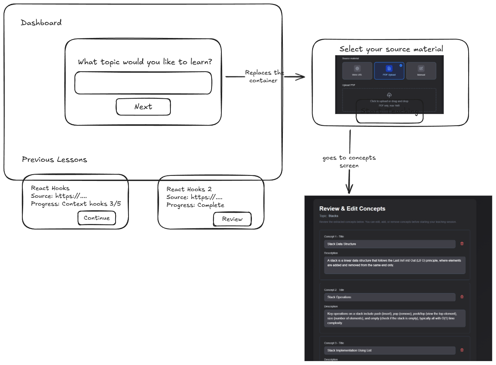

# Requirements Document - Session Dashboard

## Introduction

The Session Dashboard allows users to view their previous learning sessions, continue in-progress sessions, and start new sessions from a centralized location. Sessions are associated with authenticated users via Clerk, enabling persistent history across devices.

## Wireframe

## Glossary

- **Dashboard**: The main hub page at `/dashboard` showing session creation and history
- **Session Card**: UI component displaying a session's topic, source, progress, and actions
- **In-Progress Session**: A session where `completed === false`
- **Completed Session**: A session where `completed === true`

## Requirements

### Requirement 1

**User Story:** As a learner, I want to see all my previous sessions so that I can track my learning history

#### Acceptance Criteria

1. THE Dashboard SHALL display a list of all sessions belonging to the authenticated user
2. THE Dashboard SHALL show sessions sorted by most recently updated first
3. EACH session card SHALL display the topic name
4. EACH session card SHALL display the source URL (truncated) or "Manual" for no-source sessions
5. EACH session card SHALL display progress as "X/Y concepts" for in-progress or "Complete" for finished
6. THE Dashboard SHALL show a loading state while fetching sessions

### Requirement 2

**User Story:** As a learner, I want to continue an in-progress session so that I can pick up where I left off

#### Acceptance Criteria

1. IN-PROGRESS session cards SHALL display a "Continue" button
2. WHEN the user clicks "Continue", THE system SHALL navigate to `/teach/[sessionId]/[currentConceptIndex]`
3. THE teaching screen SHALL restore the user's previous canvas drawings for that concept
4. THE teaching screen SHALL restore the dialogue history for that concept

### Requirement 3

**User Story:** As a learner, I want to review completed sessions so that I can revisit what I learned

#### Acceptance Criteria

1. COMPLETED session cards SHALL display a "Review" button
2. WHEN the user clicks "Review", THE system SHALL navigate to `/complete/[sessionId]`
3. THE completion screen SHALL display the previously generated summary

### Requirement 4

**User Story:** As a learner, I want to delete sessions I no longer need

#### Acceptance Criteria

1. EACH session card SHALL display a delete button (trash icon)
2. WHEN the user clicks delete, THE system SHALL show a confirmation dialog
3. WHEN confirmed, THE system SHALL delete the session and its associated source material
4. THE Dashboard SHALL update to remove the deleted session

### Requirement 5

**User Story:** As a learner, I want to start a new session from the dashboard

#### Acceptance Criteria

1. THE Dashboard SHALL display a topic input field with "What topic would you like to learn?" prompt
2. WHEN the user enters a topic and clicks "Next", THE container SHALL scroll to reveal source material selection
3. THE source material selection SHALL offer: Web URL, PDF Upload, or Manual options
4. WHEN the user completes source selection and clicks "Start", THE system SHALL navigate to `/review/[sessionId]`

### Requirement 6

**User Story:** As a learner, I want my sessions to be private to my account

#### Acceptance Criteria

1. THE system SHALL associate each session with the authenticated user's ID
2. THE system SHALL only return sessions belonging to the current user
3. THE `/dashboard` route SHALL require authentication
4. UNAUTHENTICATED users SHALL be redirected to `/sign-in`
